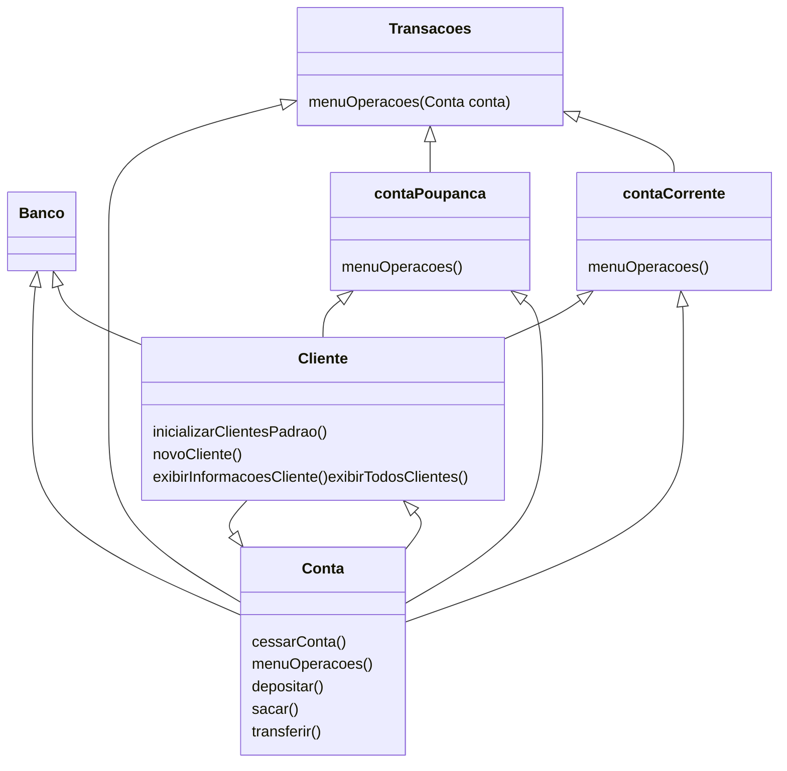

# Criando um Banco Digital com Java e Orientação a Objetos

Este é um desafio da **DIO**, na qual vem aproveitar os conhecimentos no domínio bancário, abstraindo uma solução orientada a objetos em Java. Para isso, tende a interpretar o seguinte cenário: “Um banco oferece aos seus clientes dois tipos de contas (corrente e poupança), as quais possuem as funcionalidades de depósito, saque e transferência (entre contas da própria instituição).” 
Este projeto foi desenvolvido no VS Code, com o objetivo de reforçar o conhecimento em Programação Orientada a Objetos (POO) em Java, através da implementação de um banco digital.

## Funcionalidades

Foi criado um Banco GR, ao acessar o banco o usuário poderá escolher:
- Acessar uma contar já existente,
- Criar conta

### Acessar uma conta existente
Ao escolher uma conta já existente, o usuário deverá digitar o CPF e pronto já pode utilizar a conta.

### Criar conta
Ao escolher criar conta, o usuário deverá informar seu nome completo e seu CPF. Com isso será criada duas contas para ele: uma conta corrente e uma conta poupança. Imediatamente aparecerá os dados de suas contas, na qual já poderá utiliza-lá. Assim que aceitar acessar a sua conta, para entrar nela deverá digitar seu CPF.

## Acessando a conta

Após digitar o CPF, o usuário deverá escolher qual a conta deseja entrar: corrente ou poupança, digitar o número da agência e da conta que escolheu (caso erre irá aparecer uma colinha, mostrando a conta 'corrente ou poupança' que escolheu do CPF informado), após terá acesso ao menu da conta.

### Menu da conta
1- Depósito

2- Saque

3- Tranferência: nesta opção, o usuário poderá transferir para sua outra conta ou para outro cliente do Banco

4- Ver saldo

5- Sair: aqui terá a opção de acessar outra contra, escolhendo ela, o usuário poderá verificar se a sua transferência deu certo, acessando a outra conta e vendo o saldo.

## Lista dos Clientes existentes

Cliente: João Silva
CPF: 11  
Contas:  
Conta corrente | Agência: 0001 | Conta: 00001  
Conta poupança | Agência: 0001 | Conta: 00002  

Cliente: Maria Souza  
CPF: 22  
Contas:  
Conta corrente | Agência: 0001 | Conta: 00003  
Conta poupança | Agência: 0001 | Conta: 00004  

Cliente: Carlos Lima  
CPF: 33  
Contas:  
Conta corrente | Agência: 0001 | Conta: 00005  
Conta poupança | Agência: 0001 | Conta: 00006  

Cliente: Ana Costa  
CPF: 44  
Contas:  
Conta corrente | Agência: 0001 | Conta: 00007  
Conta poupança | Agência: 0001 | Conta: 00008  

Cliente: Paulo Oliveira  
CPF: 55  
Contas:  
Conta corrente | Agência: 0001 | Conta: 00009  
Conta poupança | Agência: 0001 | Conta: 00010  

## Diagrama UML
Para elaborar o diagrama foi utilizada a extenção Markdown Preview Mermaid Support.

